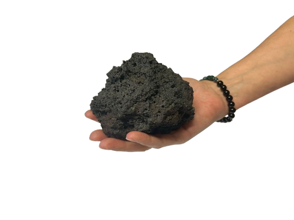
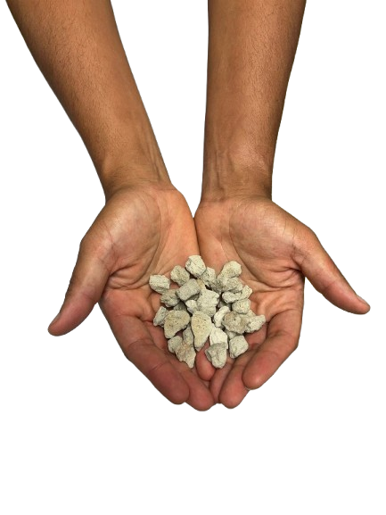
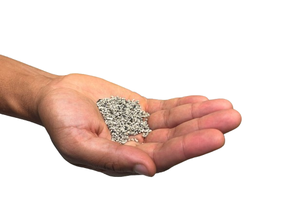

## Principe du TP

<!-- PARTIE 1 : principe, objectifs et plan réunis dans la même section. -->

Ce TP est conçu comme un atelier d'observation et de discussion à partir de modèles 3D d'affleurements, de photos d'échantillons, d'une base de données de compositions minéralogiques et géochmiques, mais aussi à partir d'échantillons réels.

À la fin de cette séance, vous devriez pouvoir :

- Décrire un affleurement et discuter son contexte géologique
- Décrire la granulométrie et les textures cristallines et vésiculaires d'un échantillon
- Nommer les roches en se basant sur des compositions minéralogiques et géochimiques

Durées indicatives des différents exercices :

| Temps | Contenu | Objectif |
|---|---|---|
| 20 min | Exercice 1 : décrire un affleurement | Relier les informations disponibles aux structures visibles de l'affleurement pour en déduire un contexte géologique |
| 20 min | Exercice 2 : décrire la texture d'un échantillon | Caractériser la granulométrie, cristallinité, et vésicularité d'un échantillon |
| 20 min | Exercice 3 : nommer une roche | Utiliser les classifications adéquates pour détermimer le nom d'une roche |
| 30 min | Exercice 4 : observations de vrais échantillons | Récapitulatif sur de vrais échantillons |

## Exercice 1 : Décrire un affleurement (20 min)

<!-- PARTIE 3 : quatre cas d'étude en modèle 3D. -->

**Consigne :** Pour chaque cas d'étude présenté ci-dessous, observez le modèle 3D et utilisez l'indice pour formuler votre propre description d'affleurement et proposition de contexte géologique (quel type de roche et pourquoi).

<article class="tp-ex-card tp-ex1-card">
  <h4>Cas d'étude 1 — Spitzkoppe (Namibie)</h4>
  
<a href="https://v3geo.com/viewer/#/341" target="_blank" rel="noopener">Ouvrir le modèle 3D — Spitzkoppe</a>

  
<strong>Indice :</strong> Ce petit modèle en surface, montre des roches qui affleurent grâce à une érosion substentielle. Les roches affleurantes sont néanmoins en place et sont datées d'environ 600 Ma lors de l'orogénèse damarienne. On observe ici des chaos de blocs façonnés par l'aridité du désert.

</article>

<article class="tp-ex-card tp-ex1-card">
  <h4>Cas d'étude 2 — Chachahuén (Argentine)</h4>
  
<a href="https://v3geo.com/viewer/index.html#/272" target="_blank" rel="noopener">Ouvrir le modèle 3D — Chachahuén</a>

  
<strong>Indice :</strong> Ce modéle montre une structure allongée où l'érosion a fait son œuvre : les roches les plus dures ressortent par rapport aux roches les plus tendres. Évaluez la continuité et la géométrie singulière de l'affleurement et réfléchissez à ce que cela peut représenter.

</article>

<article class="tp-ex-card tp-ex1-card">
  <h4>Cas d'étude 3 — Hestgerðismúli (Islande)</h4>
  
<a href="https://v3geo.com/viewer/index.html#/444" target="_blank" rel="noopener">Ouvrir le modèle 3D — Hestgerðismúli</a>

  
<strong>Indice :</strong> Les différentes faces latérales de ce vaste affleurement révèlent la structure interne de cette zone géologique. Évaluez la forme et la répétition des structures visibles pour déduire la nature et le mode d'emplacement de ces roches.

</article>

<article class="tp-ex-card tp-ex1-card">
  <h4>Cas d'étude 4 — Tajogaite (Espagne)</h4>
  
<a href="https://v3geo.com/viewer/index.html#/442" target="_blank" rel="noopener">Ouvrir le modèle 3D — Tajogaite</a>

  
<strong>Indice :</strong> Ce modèle représente une zone de plusieurs kilomètres avec plusieurs éléments observables. Essayez d'identifier les différents éléments. La situation est plus complexe qu'il n'y paraît.

</article>

## Exercice 2 : Décrire la texture d'un échantillon (20 min)

<!-- PARTIE 4 : tableau de référence pour décrire les textures. -->
### Partie 1 — Granulométrie, texture cristalline et texture vésiculaire

**Consigne :** Pour chaque échantillon présenté ci-dessous, décrivez la granulométrie ainsi que les textures cristalline et vésiculaire, en vous aidant du tableau ci-dessous et des indices à disposition.

<table>
<thead><tr><th>Granulométrie</th><th>Texture cristalline</th><th>Texture vésiculaire</th></tr></thead>
<tbody><tr>
<td>Non-applicable (massif) Bombe (arrondi)/bloc(anguleux) Lapilli Cendre</td>
<td>Grenue Porphyrique Aphyrique ou microlitique Vitreuse Autre</td>
<td>Réticulite Ponce Scorie</td>
</tr></tbody>
</table>

<article class="tp-ex-card tp-ex2-card">
  <h4>Échantillon 1</h4>
  
  
<strong>Indice :</strong> Photo d'un échantillon prélevé sur un affleurement massif. La largeur du champ est de quelques centimètres.

</article>

<article class="tp-ex-card tp-ex2-card">
  <h4>Échantillon 2</h4>
  
  
<strong>Indice :</strong> Photo d'un échantillon prélevé sur un affleurement massif. La largeur du champ est de quelques centimètres.

</article>

<article class="tp-ex-card tp-ex2-card">
  <h4>Échantillon 3</h4>
  
  
<strong>Indice :</strong> Échantillon ramassé au sol. La densité du fragment paraît intermédiaire.

</article>

<article class="tp-ex-card tp-ex2-card">
  <h4>Échantillon 4</h4>
  
  
<strong>Indice :</strong> Échantillon récolté au sein d'un log stratigraphique proche d'un volcan. Les fragments paraissent très légers.

</article>

<article class="tp-ex-card tp-ex2-card">
  <h4>Échantillon 5</h4>
  
  
<strong>Indice :</strong> Échantillon récolté au sein d'un log stratigraphique à distance d'un volcan. Les fragments paraissent très légers.

</article>

<article class="tp-ex-card tp-ex2-card">
  <h4>Échantillon 6</h4>
  
  
<strong>Indice :</strong> Photo d'un échantillon prélevé sur un affleurement massif. La largeur du champ est de quelques centimètres.

</article>

## Exercice 3 : Trouver le nom d'une roche (20 min)

<!-- PARTIE 5 : documents de référence QAPF et TAS. -->

### Composition minéralogique : diagramme QAPF de Streckeisen

Les quatre diagrammes suivants sont fournis comme références pour l'exercice :

::: {.tp-reference-diagrams}

<strong>Diagramme QAPF - Roches plutoniques</strong>

<object data="../material_used/seance_03/QAPF-plutonic.pdf" type="application/pdf" width="100%" height="600">

<a href="../material_used/seance_03/QAPF-plutonic.pdf" target="_blank" rel="noopener">Ouvrir le diagramme QAPF des roches plutoniques</a>

</object>

<strong>Diagramme QAPF - Roches volcaniques</strong>

<object data="../material_used/seance_03/QAPF-volcanic.pdf" type="application/pdf" width="100%" height="600">

<a href="../material_used/seance_03/QAPF-volcanic.pdf" target="_blank" rel="noopener">Ouvrir le diagramme QAPF des roches volcaniques</a>

</object>

:::

::: {.tp-reference-diagrams}

<strong>Diagramme O-OPX-CPX - roches mantelliques</strong>

<object data="../material_used/seance_03/Ultramafic.pdf" type="application/pdf" width="100%" height="600">

<a href="../material_used/seance_03/Ultramafic.pdf" target="_blank" rel="noopener">Ouvrir la classification des roches ultramafiques</a>

</object>

<strong>Classification minéralogique modale simplifiée</strong>

Particulièrement pratique pour l'ensemble des roches, notamment les roches basiques et mafiques, qui sont moins faciles à identifier avec le diagramme QAPF de Streckeisen.

<object data="../material_used/seance_03/modal.pdf" type="application/pdf" width="100%" height="600">

<a href="../material_used/seance_03/modal.pdf" target="_blank" rel="noopener">Ouvrir la classification minéralogique modale simplifiée</a>

</object>

:::

À l’aide des différents diagrammes d’identification fournis, identifiez les roches correspondant aux compositions présentées dans les tableaux suivants.

### Compositions minéralogiques

Pour chaque échantillon, déterminez le nom de la roche à l’aide du diagramme de référence correspondant. Les valeurs de chaque ligne sont normalisées et totalisent 100 %.

#### Échantillons plutoniques — diagramme QAPF

::: {.tp-table-scroll}
| Échantillon | Q (%) | A (%) | P (%) | F (%) |
|:--|--:|--:|--:|--:|
| P1 | 30 | 40 | 30 | 0 |
| P2 | 10 | 50 | 40 | 0 |
| P3 | 0 | 50 | 0 | 50 |
| P4 | 0 | 40 | 35 | 25 |
| P5 | 0 | 20 | 50 | 30 |
:::

#### Échantillons volcaniques — diagramme QAPF

::: {.tp-table-scroll}
| Échantillon | Q (%) | A (%) | P (%) | F (%) |
|:--|--:|--:|--:|--:|
| V1 | 25 | 45 | 30 | 0 |
| V2 | 0 | 40 | 60 | 0 |
| V3 | 0 | 20 | 50 | 30 |
| V4 | 5 | 55 | 40 | 0 |
| V5 | 0 | 0 | 30 | 70 |
:::

#### Échantillons mantelliques — diagramme O-OPX-CPX

::: {.tp-table-scroll}
| Échantillon | O (%) | OPX (%) | CPX (%) |
|:--|--:|--:|--:|
| M1 | 60 | 25 | 15 |
| M2 | 45 | 40 | 15 |
| M3 | 35 | 20 | 45 |
| M4 | 70 | 10 | 20 |
| M5 | 25 | 50 | 25 |
:::

#### Échantillons — classification modale simplifiée

Ces compositions peuvent correspondre aussi bien à des roches volcaniques qu'à des roches plutoniques.

::: {.tp-table-scroll}
| Échantillon | Olivine (%) | Pyroxène (%) | Plagioclase (%) | Amphibole (%) | Biotite (%) | Muscovite (%) | Quartz (%) | Feldspath potassique (%) |
|:--|--:|--:|--:|--:|--:|--:|--:|--:|
| E1 | 40 | 60 | 0 | 0 | 0 | 0 | 0 | 0 |
| E2 | 5 | 80 | 15 | 0 | 0 | 0 | 0 | 0 |
| E3 | 0 | 0 | 55 | 20 | 5 | 5 | 10 | 5 |
| E4 | 0 | 0 | 5 | 5 | 5 | 10 | 25 | 50 |
:::

### Composition chimique : diagramme TAS

Les deux diagrammes suivants sont fournis comme références pour l'exercice :

::: {.tp-reference-diagrams}

<strong>Nomenclature TAS — roches plutoniques</strong>

<object data="../material_used/seance_03/TAS-plutonic.pdf" type="application/pdf" width="100%" height="600">

<a href="../material_used/seance_03/TAS-plutonic.pdf" target="_blank" rel="noopener">Ouvrir le diagramme TAS pour les roches plutoniques</a>

</object>

<strong>Nomenclature TAS — roches volcaniques</strong>

<object data="../material_used/seance_03/TAS-volcanic.pdf" type="application/pdf" width="100%" height="600">

<a href="../material_used/seance_03/TAS-volcanic.pdf" target="_blank" rel="noopener">Ouvrir le diagramme TAS pour les roches volcaniques</a>

</object>

:::

À l’aide des diagrammes TAS fournis, identifiez les roches correspondant aux compositions chimiques présentées dans le tableau suivant, en appliquant à la fois la nomenclature plutonique et la nomenclature volcanique.

Les valeurs sont exprimées en pourcentage massique. Le fer total est exprimé sous la forme Fe₂O₃ᵗ. Les compositions totalisent 100 %. Pour chaque échantillon, calculez la somme Na₂O + K₂O, puis reportez la composition sur les diagrammes TAS.

::: {.tp-table-scroll}
| Échantillon | SiO₂ (%) | TiO₂ (%) | Al₂O₃ (%) | Fe₂O₃ᵗ (%) | MnO (%) | MgO (%) | CaO (%) | Na₂O (%) | K₂O (%) | P₂O₅ (%) | Total (%) |
|:--|--:|--:|--:|--:|--:|--:|--:|--:|--:|--:|--:|
| E5 | 49,0 | 1,5 | 15,5 | 12,0 | 0,2 | 7,5 | 10,5 | 2,5 | 0,8 | 0,5 | 100,0 |
| E6 | 57,0 | 1,0 | 17,0 | 8,0 | 0,2 | 4,0 | 7,0 | 3,5 | 1,8 | 0,5 | 100,0 |
| E7 | 64,5 | 0,7 | 16,5 | 5,0 | 0,1 | 2,0 | 4,0 | 4,0 | 2,7 | 0,5 | 100,0 |
| E8 | 74,0 | 0,2 | 13,5 | 2,0 | 0,05 | 0,5 | 1,5 | 3,5 | 4,5 | 0,25 | 100,0 |
| E9 | 45,5 | 2,0 | 14,0 | 13,0 | 0,2 | 6,0 | 8,5 | 5,0 | 5,0 | 0,8 | 100,0 |
:::

## Exercice 4 : Observations de vrais échantillons (30 min)

<!-- PARTIE 6 : aucune interaction à préparer sur la page. -->

Essayez d'identifier les roches présentes dans le tiroir fourni, en applicant les notions vues en cours au sein de ce TP.

